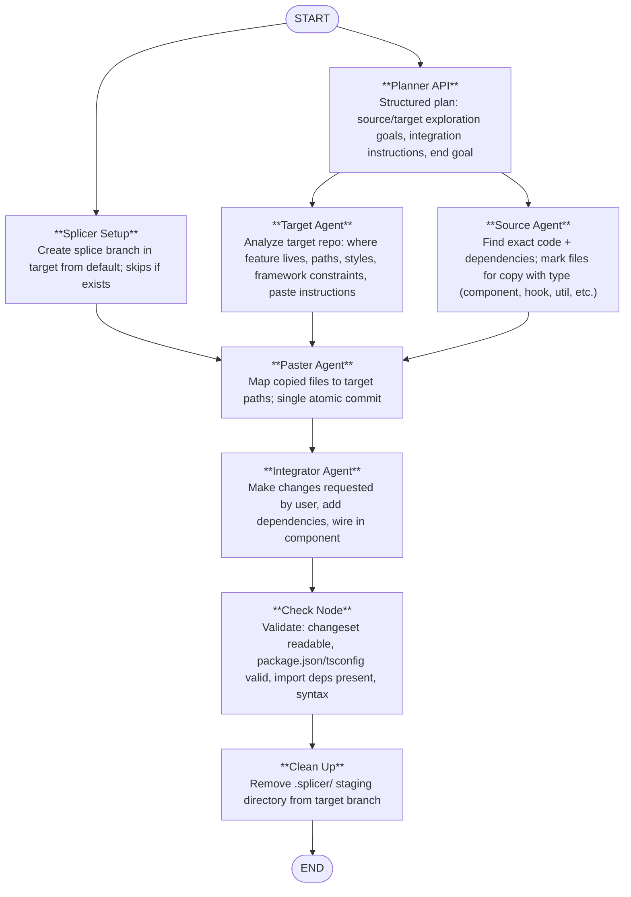

# [Splicer — AI Code Migration Agent]((https://spliceronline.com))

[](https://gemini3.devpost.com/)  
**Hackathon submission:** [gemini3.devpost.com](https://gemini3.devpost.com/)

Splicer is an **AI-powered code migration agent** built with **Google Gemini 3 Pro** and **LangGraph** that moves features from one repository into another—automating the tedious work of copying, adapting, and integrating code across different codebases. Its main use case: **combining the best parts of various prototypes** into a single target repo, with correct paths, imports, dependencies, and wiring.

🌐 **Live app:** [spliceronline.com](https://spliceronline.com)

---

## What It Does

- **Input**
    - **Source Repo** → You point to the repo that has the feature you want (e.g. a component, hook, or util).
    - **Target Repo** → You point to the repo where it should live.
    - **User Input** → You describe what to migrate (e.g. *“Add the dark mode toggle component and its styles”*).

- **Splicer** → Creates a `splice` branch in the target, finds the right code and dependencies, copies and pastes files, adapts imports and styles, adds npm deps, wires the feature in, and runs static checks. You get a PR-ready branch and, for Node.js projects, a live in-browser preview.
    - All migrations are written to a **`splice`** branch (never `main`/`master`). Merge via GitHub PR or clone the branch locally.


- **Example:** Give the same prompt to Google AI Studio, Lovable, and Bolt; then add all the features you want from the others into the best one as the base.

---

## Architecture Overview

The project is split into three services, each with its own repo and connected via the same Supabase backend:

| Service | Role | Hosting |
|--------|------|--------|
| **splicer-ai-agent** | Multi-agent LangGraph pipeline (core of submission) | Google Cloud Run |
| **splicer-webcontainer** | Ephemeral preview environments for Node.js projects | Google Cloud Run |
| **splicer-frontend** | Web UI at spliceronline.com; connects users to the agent and WebContainer | Vercel |

```
┌──────────────────────────────────────────────────────────────────────────────┐
│                         spliceronline.com (Vercel)                           │
│  ┌─────────────────────┐  ┌─────────────────────┐  ┌───────────────────────┐ │
│  │ Repo Picker, Chat & │  │ Supabase Edge:      │  │ Live Preview:         │ │
│  │ live preview UI     │─▶│ agent proxy, JWT,   │─▶│ iframe → WebContainer │ │
│  │                     │  │ streaming           │  │ dev server (HMR)      │ │
│  └──────────┬──────────┘  └──────────┬──────────┘  └───────────────────────┘ │
└─────────────┼────────────────────────┼───────────────────────────────────────┘
              │                        │
              ▼                        ▼
┌─────────────────────────┐   ┌─────────────────────────────────────────────────┐
│ Splicer AI Agent        │   │ Splicer WebContainer (Cloud Run)                │
│ (Cloud Run)             │   │ Sessions, clone, install, dev server, HMR proxy │
│ LangGraph + Gemini 3    │   │ Supabase session store                          │
└─────────────────────────┘   └─────────────────────────────────────────────────┘
```

---

## splicer-ai-agent

The migration is orchestrated by a **LangGraph** workflow powered by **Google Gemini 3 Pro**. The graph runs these nodes in order:



The pipeline is implemented in **Python** with **LangChain** and **LangGraph** in **splicer-ai-agent**. Each node uses **Google Gemini 3 Pro** for reasoning; agents that need repo access use **GitHub MCP** and custom tools.

**Tools**

| Tool | Type | Description | Usage |
|------|------|-------------|--------|
| `get_file_contents` | GitHub MCP | Read file content (supports line ranges) | Target, Source, Integrator, Check, Clean up |
| `search_code` | GitHub MCP | Search code patterns and files in repo | Target, Source, Integrator |
| `search_repositories` | GitHub MCP | Repo metadata, dependencies, structure | Target, Source |
| `push_files` | GitHub MCP | Atomic create/update files (single or batch commit) | Paster, Integrator |
| `create_branch` | GitHub MCP | Create branch in repo | Splicer Setup |
| `delete_file` | GitHub MCP | Delete file in repo | Clean up |
| `copy` | custom | Mark file for migration with type (component, hook, util, style, config, asset) | Source |
| `paste` | custom | Transfer copied_files to target with path mapping; single commit via push_files | Paster |
| `dependency` | custom | Add npm package to package.json; returns updated content for push_files | Integrator |

---

## splicer-webcontainer

The in-browser **live preview** only works for **Node.js** projects (npm, yarn, pnpm; Vite, Next.js, Nuxt, SvelteKit, Angular, Svelte, Vue, React). For other stacks the agent still migrates code; you run or verify the result locally or in CI.

splicer-webcontainer is the backend for those previews. For each preview:

1. Create a session (stored in Supabase).
2. Clone the repository (public or private with token).
3. Install dependencies (auto-detect package manager: npm, yarn, or pnpm).
4. Start the dev server with port allocation and health checks.
5. Proxy HTTP and WebSocket traffic (for HMR) to the dev server via a tokenized URL.

---

## splicer-frontend

The frontend is a React app (Vite, Tailwind) hosted at [spliceronline.com](https://spliceronline.com). It was initially created with **Google AI Studio** for all UI and initial Supabase integration in just a couple of prompts, then developed further in Cursor. The app provides the repo picker, chat interface, streaming agent responses, and the live preview iframe. Supabase Edge Functions power the agent proxy (issuing JWTs and streaming to the Cloud Run agent), preview session create/status/stop, and GitHub authentication and OAuth callbacks.

- **Fork public repos:** You can fork a public repo into your account by pasting a link and use it as source or target—theoretically any public repo; the app checks license and may block forking when the license does not allow it.
- **Auth and repo access:** Supabase authentication is with **GitHub**; a **GitHub App** is used for access to repositories. The agent uses **GitHub MCP** to read, search, and push changes in the right places.

---

## How to Use

All migrations are written to a **`splice`** branch (not `main`/`master`). To use the updated code either:

- **Merge on GitHub** — Open the repo on GitHub, create a Pull Request from `splice` → `main`, then merge.
- **Clone the splice branch locally** — `git clone -b splice https://github.com/OWNER/REPO.git`
    - Replace `OWNER` and `REPO` with your username and repository name.

---

## License

Allowed use for the [Gemini 3 Hackathon](https://gemini3.devpost.com/) per hackathon rules. No separate license file; see the linked hackathon for terms and requirements.
