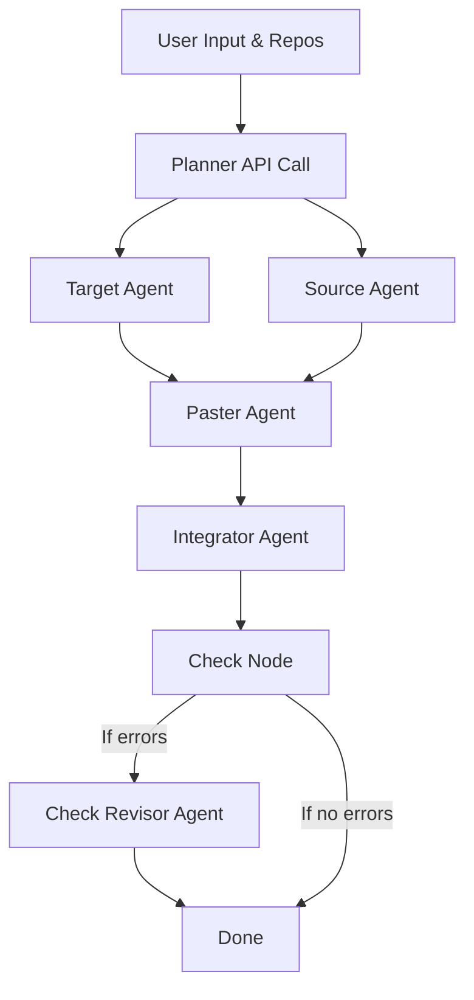

# Code Migration Agent

This agent system is designed to automate the process of migrating code features
from a **Source Repository** to a **Target Repository**.

---

## Multi-Agent Framework

---

## Agents

1. **Planner API Call**: The entry point of the system. It normalizes user input
   and repository metadata into a structured plan.
   - **Tools**: None (uses structured LLM output)

2. **Target Agent**: Analyzes the target repository to determine where the new
   feature should live, identifying framework constraints, styling patterns, and
   architectural requirements.
   - **Tools**: `get_file_contents`, `search_code`, `search_repositories` (GitHub MCP)

3. **Source Agent**: Identifies the exact source code snippets and their
   dependencies. It traces every file the feature relies on to ensure a complete
   migration.
   - **Tools**: `get_file_contents`, `search_code`, `search_repositories` (GitHub MCP), `copy` (custom)

4. **Paster Agent**: Takes the files identified by the Source Agent and places
   them into the correct locations in the Target Repository as determined by the
   Target Agent.
   - **Tools**: `push_files` (GitHub MCP), `paste` (custom)

5. **Integrator Agent**: Adapts the pasted code to the target environment. It
   refactors imports, adjusts styles, and wires the component into the existing
   structure using slim adapters.
   - **Tools**: `get_file_contents`, `search_code`, `push_files` (GitHub MCP), `dependency` (custom)

6. **Check Node**: Runs programmatic static validation on the integrated code.
   Checks for syntax errors, missing dependencies, broken imports, and validates
   configuration files (package.json, tsconfig.json).
   - **Tools**: `get_file_contents` (GitHub MCP)

7. **Check Revisor Agent**: If the Check Node finds errors, this agent performs
   surgical fixes. It focuses only on reported problems rather than re-doing the
   entire integration.
   - **Tools**: `get_file_contents`, `search_code`, `push_files` (GitHub MCP), `dependency` (custom)

---

## Tools

### GitHub MCP Tools

The system primarily leverages GitHub MCP (Model Context Protocol) tools for repository operations:

- **get_file_contents**: Read file content from a repository (supports line ranges)
- **search_code**: Search for code patterns and files within a repository
- **search_repositories**: Retrieve repository metadata including dependencies and structure
- **push_files**: Atomically create or update files in a repository (handles single or batch commits)

### Custom Tools

Domain-specific tools that extend GitHub MCP functionality:

- **copy**: Structure a file for migration with type classification (component, hook, util, type, style, config, asset). Marks files from the source repository for copying.
- **paste**: Transfer files from copied_files to the target repository with path mapping. Batches all files into a single atomic commit via push_files.
- **dependency**: Add npm packages to target repository's package.json. Returns updated content for writing via push_files.
